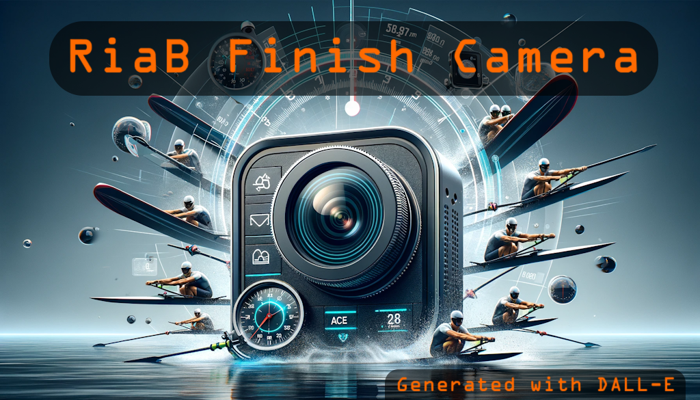
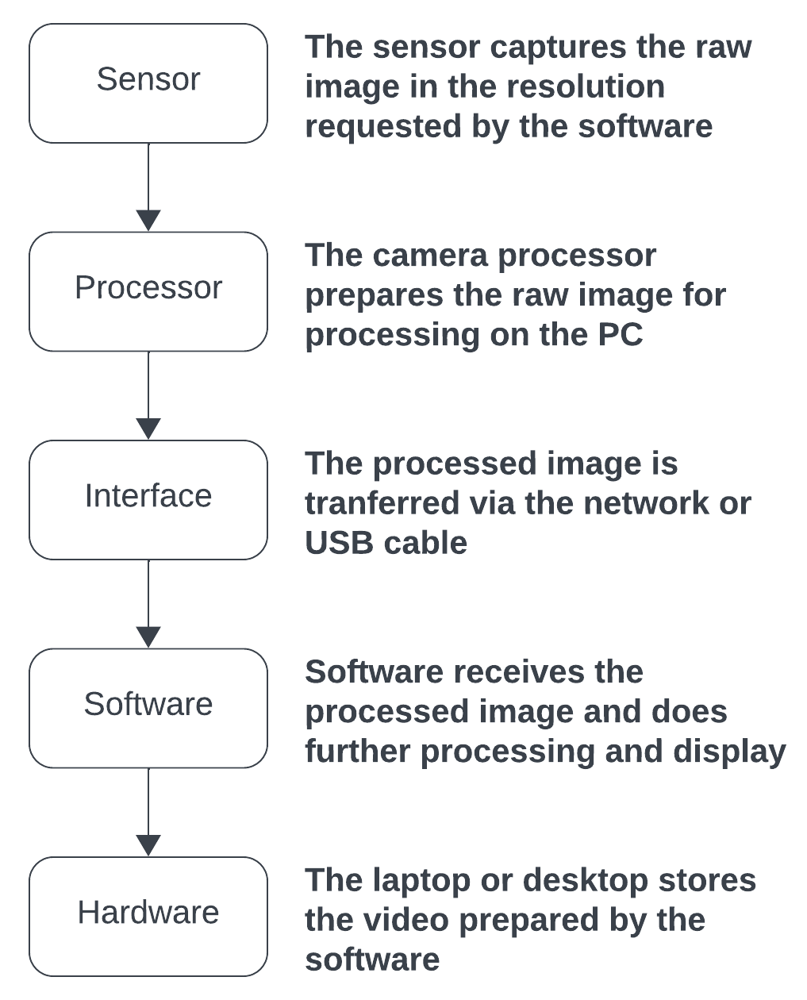
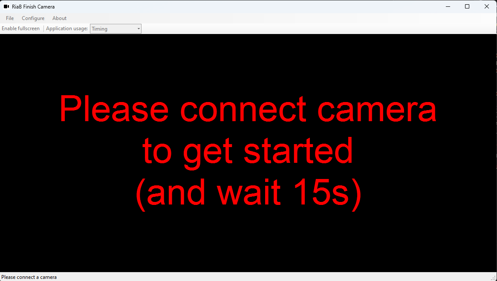
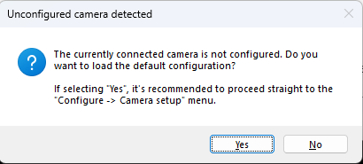
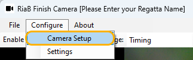
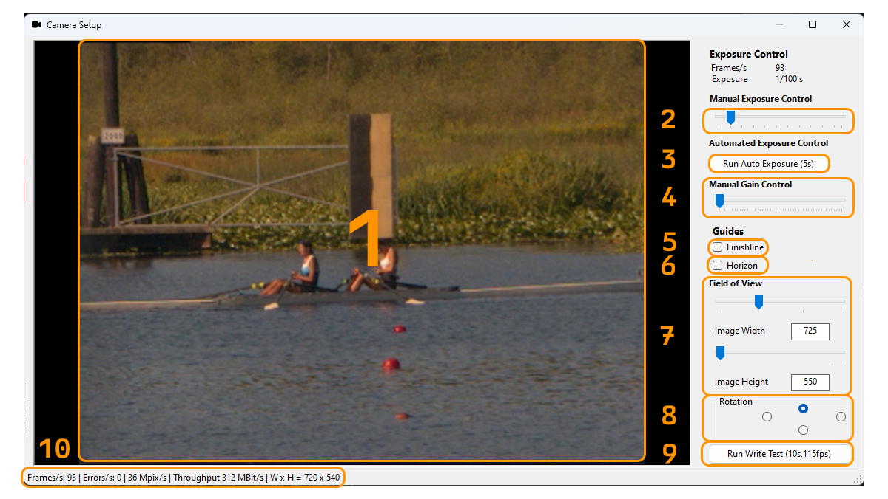
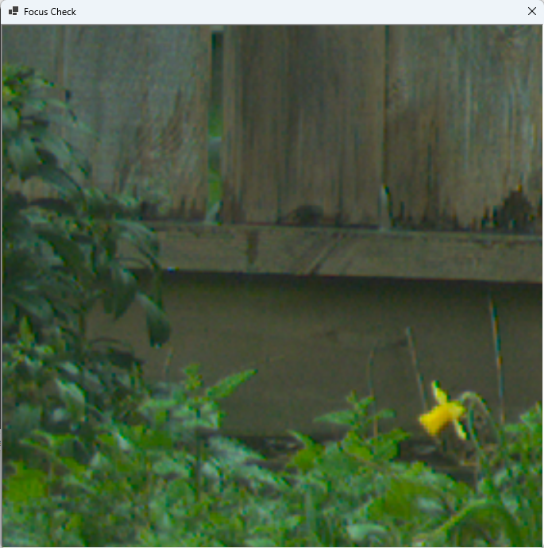
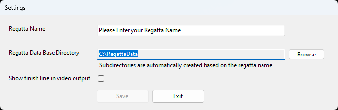
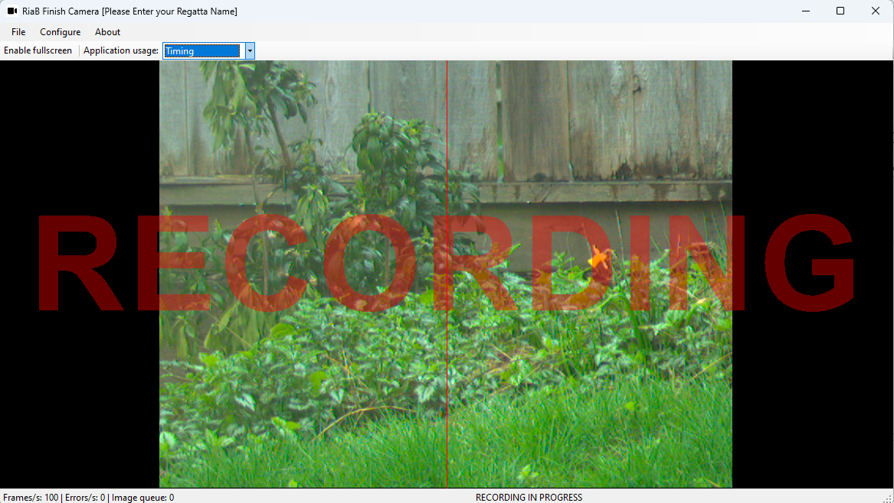

# Regatta in a Box camera software

# Introduction

The Regatta in a Box (RiaB) Finish Camera software was developed to provide a low cost option that requires little training for regattas that need a photo finish system.

It was specifically designed to meet the requirements of the [Canadian Rules of Racing](https://rowingcanada.org/uploads/2022/04/Rules-of-Racing-Booklet-EN.pdf):

> In the case of close finishes, the order of finish must be determined by means of special equipment such as a photo finish camera, capable of measuring and displaying differences to at least 1/100th of a second

A secondary design goal was that a volunteer should be able to use the software comfortably with less than an hour of training.

The software is designed to work with the [CrewTimer Video Review](https://admin.crewtimer.com/help/VideoReview) software.

The software supports the [Basler range of area scan cameras](https://www.baslerweb.com/en-us/cameras/area-scan-cameras/). The "Appendix I: Supported cameras" provides a complete list of cameras that were tested.

**A powerful laptop with SSD drive is required to capture video at the required rates. You should carefully test the setup you plan to use at your event to ensure that performance is in line with your requirements.**

# Some core concepts

The setup of the system is much easier understood if some core concepts are well understood. This section tries to do that. Please send feedback to make it easier to understand :)

## The process flow

An image captured by the camera flows through a chain of actions before it’s saved to disk where it can be reviewed by you.

In order to be able to review finishes with an accuracy of at least 100th/s the whole chain needs to be tuned for that.

The tuning is what this manual covers. It’s different for each combination of camera and laptop/desktop. It can even be impacted by things like the battery level of your laptop.

With a higher resolution camera, most systems are not able to keep up by default.

## Framerate

The frame rate, expressed in **Frames per Second** or **FPS**, is exactly what the name suggests. It’s the number of images the software is able to write into the resulting video files.

As you can see in the previous section, the final frame rate is impacted by all elements of the system. If it’s important for your event to have timing accurate to 1/100th/s, you need to ensure that the software always indicates you are capturing at least 100 FPS.

The software will provide you with warnings if you are not able to do that.

## Exposure time

The **exposure time** is the time the camera needs to expose one image. The camera is able to determine the “correct” exposure automatically. But since the exposure time directly translates to framerate, we want to be in full control over it.

Under bright conditions, this is not usually an issue. Your exposure time might be 1/250th/s, giving you a potential frame rate of 250 FPS.

When it’s darker, you might have challenges. Let’s say that your exposure time is 1/10th/s, giving you a potential frame rate of 10 FPS.

There is not a lot you can do about this, your lens (a faster lens lets in more light) and the lighting conditions are the only things that impact this.

You might have to accept that you are not getting times accurate to 1/100th/s until things get brighter.

The camera provides one control that we will discuss next.

## Gain

The camera provides the ability to amplify the amount of light received by increasing the **gain**. This has the effect of reducing the exposure time, and thus increasing the framerate.

It does come at the cost of extra noise in the image. You will have to do some testing to ensure that you are still able to properly read the smallest bow numbers. The noise in the image will make that harder to do.

## Field of View

High resolution cameras at high frame rates produce large amounts of data. The amount of data is so large that a regular laptop is unlikely to keep up with it.

The best option to deal with this is by reducing the Field of View, ie. by instructing the camera to only capture a portion of the full image size. Because we are only really interested in the few pixels on the finish line, this actually works quite well for us.

## Setting up the hardware

## What you need

Below is a list of the things needed to use the software for timing:

- [ ] Basler Area Scan camera
- [ ] Lens
- [ ] Ethernet or USB cable that provides the reach needed for your site setup
- [ ] A network switch when using the GigE network cameras
- [ ] Internet connection
- [ ] A router
- [ ] Reliable time source
- [ ] A dependable power source
- [ ] A laptop with as much processing power as possible
- [ ] An external hard drive to stores the captured videos
- [ ] An external mouse
- [ ] A mouse pad
- [ ] Tripod (or other mounting options)

## Camera

The Basler range of cameras comes in two hardware types:

- USB
- GigE (network)

The USB cameras are a little cheaper, but are limited in how they can be used, because the maximum length of USB cable is relatively limited (10ft, 3M).

It’s recommended to use the network camera types (GigE). For this you also need a network switch that provides Power over Ethernet (POE).

See Appendix I: "Supported cameras" for details on what cameras have been tested with the software. If you end up testing with a camera model not listed. Please contact [Bas Rijniersce](mailto:bas@brijn.nu) to add the details to the list.

## Lens

The Basler camera does **not** come with a lens. The Basler cameras are industrial cameras and come with a mount that is standard for that type of camera. A great way to get access to lenses is by buying an adapter ring. The Raspberry Pi camera uses the same mount, and that has resulted in a good number of options to adapt more common lenses. Some options are:

- Edmunds sells [adapters](https://www.edmundoptics.com/f/c-mount-camera-lens-adapters/11617/#)
- Amazon sells the [K & F concept adapters](https://www.amazon.ca/Concept-Mount-Adapter-C-mount-Camera/dp/B076V96QP9/?th=1) for many different lens types

You can either rent a lens appropriate for your regatta venue or see if the LOC can locate one in the membership. It’s highly recommended to test your lens and adapter combination before your regatta.

## Network switch

The TP-Link TL-SG1005P is a good entry level switch that has been tested with the Basler cameras and can be found for around CA$ 50.

If budget allows, the TP-Link TL-SG105PE provides some extra management and capabilities that can be helpful in certain deployments. The cost is not much higher at around CA$ 80.

## Router / Internet connection

When using the network cameras, you need a device in the network that provides a network address to the laptop and the camera. Since we need an internet connection as well, this is often a wireless (4G) router. Please work with your LOC technical resource to ensure a reliable internet connection is available.

## Reliable time source

See [this section](#using-extremely-precise-timestamping) for some more detail if you want extremely accurate time. By default the software relies on the time of the PC. It's recommended to use the ["Time-Sync" software](https://www.speed-soft.de/software/time_sync/index.php) developed by Rainer Döpke at Speed-Soft. Using "pool.ntp.org" as a time source with a sync every minute is a good start. If you are using more then one camera to determine race time, you should read the section linked earlier.

## Laptop

Although any Windows laptop will work, a modern laptop with more processing power is helpful in achieving higher frame rates. It’s highly recommended to do extensive testing before your event to understand the performance limitations of your system.

## Tripod

You need an option to mount your camera + lens and allow adjustments to align the camera with the horizon and finish line. The[ K & F Concept 3 Way geared head](https://www.amazon.ca/dp/B0BTD7K2W8?ref=ppx_yo2ov_dt_b_product_details&th=1) is a nice option.

# Putting it all together

The setup is straight forward:

- [ ] Connect the camera to the PoE network switch
- [ ] Connect the laptop to the PoE network switch
- [ ] Connect the router to the PoE network switch
- [ ] Power everything up

At this point you can start the software for your testing.

# Setting up the software

## Initial startup

Assuming you have installed the software. You can start it up, you will be presented with a camera detection screen:

If a camera is detected, and this is the first time you start the software with that camera, you will be asked to load some defaults:

Next step is to configure the camera as per the applications suggestion.

## Configuring the camera

From the menu, select “Configure” -> “Camera Setup”

The setup you will do now, is usually done at the start of the day, or when light conditions have changed a lot. The main screen looks like this:

1. The current Field Of View captured by the camera
2. The slider that allows you to manually set the exposure time
3. A button to kick off an auto exposure cycle
4. The slider that allows you to introduce additional gain (light sensitivity)
5. Show a line that should be placed on the finish line
6. Show a line to level the camera with the horizon
7. Adjust the Field of View down to increase frame rates, maximize bow number visibility
8. Rotate the captured image
9. Perform a test to see if the system can hit the 100 fps mark with the current settings
10. Capture metrics

### Setting the focus

You will want to use your lens controls to set the focus for your camera. You normally do a rough focus to complete the rest of your setting. Once you have completed your setup, you ideally have a few boats cross the finish line to ensure you can properly see all the bow markers in both the closest and the far lane. You will want to adjust the focus to be the best for the far lanes, since the larger bow markers in the closer lanes will make it easier to read them.

You can **right-click** in the image to open a zoomed focus window. Use the scroll wheel button to zoom in out further. You can right click in the main window again to change the point of focus:

### Setting the exposure

A good place to start is to run the auto exposure button [3]. It usually needs some minor adjustments for a usable view. 

If you get at better then 100 FPS here, you are usually done. In this example case, we have some choices to make. If it’s important you capture at 100 FPS, you should continue to play with the exposure [2] and gain [4] controls.

It’s often possible to reduce your exposure until you hit 100 FPS and introduce a little bit of gain.

This is a good area to explore at home before race day to get familiar with the impacts and options.

If your bow numbers are black on white, having the image fairly dark (helping with frame rate) improves readability.

### Leveling the camera

To ensure that the camera finish line is properly aligned with the physical finish line, we want to make sure the camera is properly leveled.

Left clicking anywhere in the image will allow you to place a horizontal guide on the actual horizon. You can now use your tripod tilt head to make adjustments to the level.

### Aligning with the finish line

Click the “Show Finish Line Guide” checkbox to show the centerline in the image. The line should be placed on the transition from yellow to black on the far side finish board.

At the finish line position there is hopefully a survey market or other indication for where the finish line is exactly. You will need to work with your finish umpires to determine a safe spot for the camera that allows the needed movement of people while safeguarding the proper alignment of the camera.

### Write test

At this point you should be happy with all your settings, alignment etc. It’s however important to determine if your system can handle the data produced at the framerate you selected. Press the “Write test” [9] button to initiate a ten second test.

If your system is not able to keep up, you will get this warning:

See the next section on how to adjust the Field of View to reduce the amount of data.

When your system is able to handle the amount of data produced, you will see this message after ten seconds:

### Adjusting the Field of View

When your camera is producing more data then it can handle, you can try to reduce the Field of View with the sliders [7] and rerun the write test until you pass it.

If you have reduced your Field of View to the lowest setting and you still can’t pass the write test, and there is no option to get more performant hardware, you have no choice but to reduce the exposure time. If that produces images that are too bright to use, you can select the “Finish order only” mode in the main view. This reduced the frame rate to 24 FPS.

### Closing the window

When you close the window with the [X] in the top right, all your settings are stored. When you restart the application with the same camera attached, these settings will be applied.

# Setting up the regatta

From the menu, select “Configure” -> “Settings”

In the menu that open can you can set your storage location and regatta name. When you integrate with CrewTimer Video Review, you want to leave the "SHow finish line in video output" unselected. This is shown in the review software.

Press Save to store your settings, follow by “Exit”.

Additional directories will be created as needed.

If you are using an external hard drive, ensure to pick that here.

# Capturing finishes

Using the software is extremely straightforward. It’s designed to integrate with CrewTimer Video Review for review of finish times. The CrewTimer Video Review also allows you to start the recording and split video files.

If you are not using CrewTimer Video Review, you can still operate the software manually.

## Starting a recording

With the main screen active, press the spacebar. You will hear a sound to indicate the recording started. A message across the camera view will also indicate a recording is in progress

You can monitor frame rate and errors in the bottom left. Video files will be written into the directory you selected every five minutes, or when you stop the recording. You can use something like VLC media player to review your videos. Windows explorer provides some basic information on recording size and framerate

To stop the recording, you press the spacebar again.

## Other UI options

There are only two other options provided in the user interface. The ability to enter a full screen mode, and the ability to force the application to a 24 FPS mode for finish order only (not timing)

# Using extremely precise timestamping

The Basler Pro GigE camera's support [Precision Time Protocol](https://en.wikipedia.org/wiki/Precision_Time_Protocol). When a PTP Master Clock is in the same network (specifically the same broadcast domain) the camera will pick up the time and all frames will be timestamped with this extremely accurate information. Testing has shown an accuracy of better then 5 ms.

The main user interface will indicate if a reliable PTP source is found in the network. Please note that your network switch needs to support PTP. The "TP-Link TL-SG105PE" referenced earlier has been extensively tested.

If you do not have access to a PTP time source, a NTP time source in the local network provides very good performance. It should not be a problem to get 10ms or better accuracy.

When not using PTP, the software will timestamp using the time of the PC. See the setup section for a software recommendation to have better control over the PC time.

A local time source becomes of great importance when your timing system leverage multiple cameras to determine for example overall race time.

# Appendix I: Supported cameras

The "Basler Ace 2 R" is the recommended camera.

| **Model**                                                    | **Resolution** | **FPS** | **Interface** | **Mount** | **Cost** |
| ------------------------------------------------------------ | -------------- | ------- | ------------- | --------- | -------- |
| [Basler Dart](https://www.baslerweb.com/en-us/shop/daa1440-220uc-cs-mount/) | 1440 x 1080    | 227     | USB-3         | CS        | US$ 265  |
| [Basler Ace 2 Basic](https://www.baslerweb.com/en-us/shop/a2a1920-160ucbas/) | 1920 x 1200    | 160     | USB-3         | C         | US$ 389  |
| [Basler Ace](https://www.baslerweb.com/en-us/shop/aca720-290gc/) | 720 x 540      | 291     | GigE          | C         | US$ 399  |
| [Basler Ace 2 Pro](https://www.baslerweb.com/en-us/shop/a2a1920-160ucpro/) | 1920 x 1200    | 160     | USB-3         | C         | US$ 509  |
| [Basler Ace 2 R ](https://www.baslerweb.com/en-us/shop/a2a1920-51gcpro/) | 1936 x 1216    | 51      | GigE          | C         | US$ 499  |

Note that cameras will deliver a higher frame rate when a reduced Field of View is used. All the cameras here will achieve 100 FPS for timing purposes.
